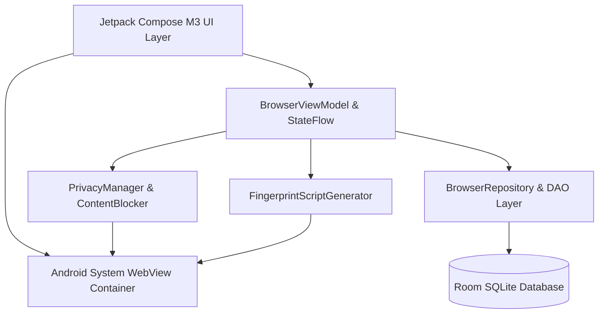

<div align="center">

# 🌐 Feather Browser for Android

<p align="center">
  <strong>An ultra-lightweight (~1.3 MB), high-performance, privacy-first Android browser featuring true isolated multi-profiles with custom device fingerprint spoofing.</strong>
</p>

[](https://github.com/Likhon545466/lightweight_browser/releases/latest)
[](https://github.com/Likhon545466/lightweight_browser/actions)
[](https://github.com/Likhon545466/lightweight_browser/releases/latest)
[-3DDC84?style=for-the-badge&logo=android&logoColor=white)](https://www.android.com/)
[](https://kotlinlang.org/)
[](https://developer.android.com/jetpack/compose)
[](LICENSE)

<br />

[📥 Download Latest APK (v1.0.8)](https://github.com/Likhon545466/lightweight_browser/releases/latest) • [🌟 Core Differentiators](#-core-differentiators) • [🛡️ Multi-Profile Isolation](#-isolated-multi-profiles--fingerprint-spoofing) • [✨ Feature Highlights](#-feature-highlights) • [🛠️ Architecture](#-architecture--tech-stack) • [🚀 Building from Source](#-building-from-source)

---

</div>

## 📖 Overview

**Feather Browser** is an open-source, minimalist web browser engineered from the ground up for speed, low resource consumption, and uncompromised privacy. Unlike mainstream mobile browsers that consume hundreds of megabytes of storage and track user activity, Feather Browser compiles into a lean **~1.3 MB APK** while offering desktop-grade features like **Isolated Multi-Profiles**, **Device Fingerprint Spoofing**, and a **Built-in Ad & Tracker Blocker**.

Built purely in **Kotlin** and **Jetpack Compose (Material Design 3)**, Feather delivers dynamic Material You theming, instant cold starts, and buttery-smooth 120Hz scrolling.

---

## 🌟 Core Differentiators

| Unique Capability | Why It Sets Feather Apart |
| :--- | :--- |
| 🪶 **Ultra-Lightweight (~1.3 MB)** | 90%+ smaller than standard browsers (Chrome ~150MB, Firefox ~90MB). Stripped of unnecessary bloat, third-party analytics SDKs, and background daemon services. |
| 👥 **True Multi-Profile Isolation** | Separate browser personas within a single app. Each profile maintains its own dedicated sandbox: independent cookies, localStorage, indexedDB, web cache, tabs, bookmarks, and history. |
| 🎭 **Hardware & Fingerprint Spoofing** | Each profile can emulate distinct hardware/platform signatures (Windows, macOS Safari, iOS, Linux Firefox, Stealth) to defeat browser fingerprinting and cross-site tracking. |
| 🛡️ **Zero-Overhead Content Blocker** | Inbuilt network-level request interceptor that blocks ads, tracking pixels, and telemetry beacons before network requests are dispatched. |
| ⚡ **Instant Cold Boot & Low RAM Usage** | Near-zero startup latency with optimized R8 tree-shaking and memory-efficient Compose layout trees. |

---

## 🛡️ Isolated Multi-Profiles & Fingerprint Spoofing

Most mobile browsers share a single global cookie jar and device identity across all tabs, making it trivial for ad networks to track your identity across sessions. **Feather Browser solves this with containerized profile architecture:**

```
┌────────────────────────────────────────────────────────────────────────┐
│                        Feather Browser Engine                          │
└───────┬────────────────────────┬────────────────────────┬──────────────┘
        │                        │                        │
  ┌─────▼──────────────┐   ┌─────▼──────────────┐   ┌─────▼──────────────┐
  │  Profile: Personal │   │    Profile: Work   │   │  Profile: Stealth  │
  ├────────────────────┤   ├────────────────────┤   ├────────────────────┤
  │ • Android Chrome   │   │ • Windows 11 Edge  │   │ • Canvas & WebGL   │
  │ • Personal Cookies │   │ • Work SSO Cookies │   │   Noise Spoofing   │
  │ • Home Bookmarks   │   │ • Corp Bookmarks   │   │ • Randomized Core/ │
  │ • Independent Tabs │   │ • Independent Tabs │   │   RAM Signature    │
  └────────────────────┘   └────────────────────┘   └────────────────────┘
```

### 🎭 Built-in Fingerprint Presets:
1. **Default (Native Android)**: Standard modern Mobile Chrome / Android 14 headers.
2. **Windows Desktop**: Emulates Windows 11 x64, Google Chrome desktop User-Agent, and `Win32` navigator platform.
3. **macOS Safari**: Emulates Apple Safari, Macintosh Intel platform, and WebKit rendering strings.
4. **iPhone iOS**: Emulates Mobile Safari on iPhone / iOS 17.
5. **Linux Firefox**: Emulates Gecko layout engine on X11 Linux.
6. **Stealth Anonymous**: Anti-fingerprinting shield that injects dynamic noise into HTML5 Canvas 2D renderers, WebGL vendor/renderer strings, AudioContext frequency analysis, and spoofs `navigator.hardwareConcurrency` and `navigator.deviceMemory`.

### 💡 Real-World Use Cases:
- **Multiple Account Management**: Log into multiple accounts on the same website (e.g., GitHub, Twitter, Google, Reddit) simultaneously without logging out or opening incognito windows.
- **Tracker Defeat**: Prevent tracking networks from correlating your work identity, personal browsing, and financial activity.
- **Web Developer & QA Testing**: Verify responsive web designs and User-Agent specific behaviors directly on device.

---

## ✨ Feature Highlights

- 🛡️ **Native Ad & Tracker Blocker**: Blocks intrusive pop-ups, banner networks, and telemetry scripts without requiring heavy extensions.
- 🎨 **Material You Dynamic Theming**: Adapts seamlessly to your device's Android 12+ wallpaper colors, with Light, Dark, and true Pitch-Black (`#000000`) AMOLED modes.
- 🕵️ **Ephemeral Private Browsing**: One-tap incognito tabs that wipe cookies, session tokens, and cache immediately upon closing.
- 🔍 **Multi-Engine Search Selector**: Switch instantly between Google, DuckDuckGo, Brave Search, and Bing directly from search settings.
- 📑 **Visual Tabs Manager**: Intuitive tab switcher with real-time website favicons, tab counts, and swift swipe-to-dismiss gestures.
- 📱 **Desktop Site Mode**: Instant one-tap switcher between mobile and desktop site layouts.
- 🔎 **In-Page Find & Highlight**: Live text search within web pages featuring match indicators and jump navigation.
- 💾 **Local-Only Persistence**: Fast Room database with SQLite for bookmarks and history. Zero cloud sync or telemetry.
- ⬇️ **Native Download Manager**: Integrated download handler with file opening, progress tracking, and clean directory management.

---

## 🛠️ Architecture & Tech Stack



- **Language:** 100% [Kotlin](https://kotlinlang.org/) with Coroutines & StateFlow
- **UI Framework:** [Jetpack Compose](https://developer.android.com/jetpack/compose) with Material Design 3 (M3)
- **Web Rendering:** Android System WebView with AndroidX WebKit extensions
- **Data Persistence:** [Room Database](https://developer.android.com/training/data-storage/room) with SQLite
- **Architecture Pattern:** MVVM (Model-View-ViewModel) + Unidirectional Data Flow (UDF)
- **Optimization:** R8 full-mode shrinking, ProGuard optimization, resource stripping

---

## 🚀 Building from Source

### Prerequisites
- **JDK:** OpenJDK 17 or OpenJDK 21
- **Android Studio:** Hedgehog (2023.1.1) / Ladybug or newer
- **Android SDK:** Platform 34+ (Android 14 / 15 ready)

### Clone & Build
```bash
# 1. Clone the repository
git clone https://github.com/Likhon545466/lightweight_browser.git
cd lightweight_browser

# 2. Run Tests
./gradlew test

# 3. Assemble Release APK
./gradlew assembleRelease
# Output: app/build/outputs/apk/release/app-release.apk
```

---

## 🔒 Permissions & Privacy Guarantee

Feather Browser only requests permissions strictly required for browsing:

| Permission | Purpose |
| :--- | :--- |
| `android.permission.INTERNET` | Required to fetch web pages requested by the user. |
| `android.permission.ACCESS_NETWORK_STATE` | Used to detect offline state and trigger network reconnects. |

> **Privacy Guarantee:** Feather Browser collects **0% telemetry**. No URLs, search queries, IP addresses, or device analytics are ever logged, sent to external servers, or sold. Everything stays strictly on your physical device.

---

## 📄 License

This project is open source and licensed under the **MIT License** - see the [LICENSE](LICENSE) file for details.

