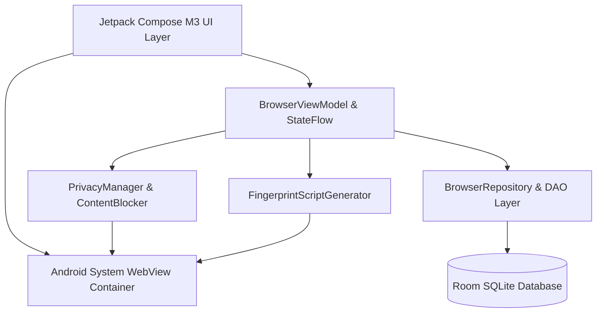

<div align="center">

# 🌐 Feather Browser for Android

<p align="center">
  <strong>An ultra-lightweight (~1.5 MB), high-performance, privacy-first Android browser featuring true isolated multi-profiles with custom device fingerprint spoofing.</strong>
</p>

[](https://github.com/aanneion/lightweight_browser/releases)
[](https://github.com/aanneion/lightweight_browser/actions)
[](https://github.com/aanneion/lightweight_browser/releases)
[-3DDC84?style=for-the-badge&logo=android&logoColor=white)](https://www.android.com/)
[](https://kotlinlang.org/)
[](https://developer.android.com/jetpack/compose)
[](LICENSE)

<br />

[🌟 Core Differentiators](#-core-differentiators) • [🛡️ Multi-Profile Isolation](#-isolated-multi-profiles--fingerprint-spoofing) • [✨ Feature Highlights](#-feature-highlights) • [🛠️ Architecture](#-architecture--tech-stack) • [🚀 Building from Source](#-building-from-source) • [🔑 Release Signing & Updates](#-release-signing--seamless-in-place-updates)

---

</div>

## 📖 Overview

**Feather Browser** is an open-source, minimalist web browser engineered from the ground up for speed, low resource consumption, and uncompromised privacy. Unlike mainstream mobile browsers that consume hundreds of megabytes of storage and track user activity, Feather Browser compiles into a lean **~1.5 MB APK** while offering desktop-grade features like **Isolated Multi-Profiles**, **Device Fingerprint Spoofing**, a **Built-in Ad & Tracker Blocker**, and **Background YouTube & Media Playback** with lock screen controls.

Built purely in **Kotlin** and **Jetpack Compose (Material Design 3)**, Feather delivers dynamic Material You theming, instant cold starts, and buttery-smooth 120Hz scrolling.

---

## 🌟 Core Differentiators

| Unique Capability | Why It Sets Feather Apart |
| :--- | :--- |
| 🪶 **Ultra-Lightweight (~1.5 MB)** | 90%+ smaller than standard browsers (Chrome ~150MB, Firefox ~90MB). Stripped of unnecessary bloat, third-party analytics SDKs, and background daemon services. |
| 👥 **True Multi-Profile Isolation** | Separate browser personas within a single app. Each profile maintains its own dedicated sandbox: independent cookies, localStorage, indexedDB, web cache, tabs, bookmarks, and history. |
| 🎭 **Hardware & Fingerprint Spoofing** | Each profile can emulate distinct hardware/platform signatures (Windows, macOS Safari, iOS, Linux Firefox, Stealth) to defeat browser fingerprinting and cross-site tracking. |
| 🎵 **YouTube & Background Media Play** | Seamless background audio playback when screen is locked or browsing other tabs. Full Android `MediaSession` lock screen and notification bar controls. |
| 🛡️ **Enhanced Ad & YouTube Blocker** | Inbuilt network-level request interceptor and DOM cleaner that removes web trackers, banner ads, and blocks YouTube video prerolls, midrolls, and promoted videos with auto-skipping. |
| ⚡ **Instant Cold Boot & Low RAM Usage** | Near-zero startup latency with optimized R8 tree-shaking and memory-efficient Compose layout trees. |

---

## 🛡️ Isolated Multi-Profiles & Fingerprint Spoofing

Most mobile browsers share a single global cookie jar and device identity across all tabs, making it trivial for ad networks to track your identity across sessions. **Feather Browser solves this with containerized profile architecture:**

```
┌────────────────────────────────────────────────────────────────────────┐
│                        Feather Browser Engine                          │
└───────┬────────────────────────┬────────────────────────┬──────────────┘
        │                        │                        │
  ┌─────▼──────────────┐   ┌─────▼──────────────┐   ┌─────▼──────────────┐
  │  Profile: Personal │   │    Profile: Work   │   │  Profile: Stealth  │
  ├────────────────────┤   ├────────────────────┤   ├────────────────────┤
  │ • Android Chrome   │   │ • Windows 11 Edge  │   │ • Canvas & WebGL   │
  │ • Personal Cookies │   │ • Work SSO Cookies │   │   Noise Spoofing   │
  │ • Home Bookmarks   │   │ • Corp Bookmarks   │   │ • Randomized Core/ │
  │ • Independent Tabs │   │ • Independent Tabs │   │   RAM Signature    │
  └────────────────────┘   └────────────────────┘   └────────────────────┘
```

### 🎭 Built-in Fingerprint Presets:
1. **Default (Native Android)**: Standard modern Mobile Chrome / Android 14 headers.
2. **Windows Desktop**: Emulates Windows 11 x64, Google Chrome desktop User-Agent, and `Win32` navigator platform.
3. **macOS Safari**: Emulates Apple Safari, Macintosh Intel platform, and WebKit rendering strings.
4. **iPhone iOS**: Emulates Mobile Safari on iPhone / iOS 17.
5. **Linux Firefox**: Emulates Gecko layout engine on X11 Linux.
6. **Stealth Anonymous**: Anti-fingerprinting shield that injects dynamic noise into HTML5 Canvas 2D renderers, WebGL vendor/renderer strings, AudioContext frequency analysis, and spoofs `navigator.hardwareConcurrency` and `navigator.deviceMemory`.

### 💡 Real-World Use Cases:
- **Multiple Account Management**: Log into multiple accounts on the same website (e.g., GitHub, Twitter, Google, Reddit) simultaneously without logging out or opening incognito windows.
- **Tracker Defeat**: Prevent tracking networks from correlating your work identity, personal browsing, and financial activity.
- **Web Developer & QA Testing**: Verify responsive web designs and User-Agent specific behaviors directly on device.

---

## ✨ Feature Highlights

- 🎵 **YouTube & Background Media Playback**: Continue playing audio from YouTube and web media seamlessly in the background when switching tabs, minimizing the browser, or locking the device.
- 📱 **Immersive Full-Screen Web Browsing**: Dynamic auto-hiding top URL bar and bottom navigation dock that glide away when scrolling down and smoothly return when scrolling up.
- 📱 **Lock Screen & Notification Player Controls**: Full Android `MediaSession` integration providing lock screen playback controls, dynamic video title and artist display, high-resolution artwork thumbnails, and responsive play/pause/skip actions.
- 🛡️ **Enhanced YouTube & Web Ad Blocker**: Dual-layer blocking engine combining fast network URL interception with client-side DOM cleansing to block YouTube video ads, banner promos, pop-ups, and trackers without battery overhead.
- 🎨 **Material You Dynamic Theming**: Adapts seamlessly to your device's Android 12+ wallpaper colors, with Light, Dark, and true Pitch-Black (`#000000`) AMOLED modes.
- 👥 **True Isolated Multi-Profiles**: Independent browser personas with partitioned cookies, cache, local storage, history, bookmarks, and per-profile hardware fingerprint presets.
- 🕵️ **Ephemeral Private Browsing**: One-tap incognito tabs that wipe cookies, session tokens, and cache immediately upon closing.
- 🔍 **Multi-Engine Search Selector**: Switch instantly between Google, DuckDuckGo, Brave Search, and Bing directly from search settings.
- 📑 **Visual Tabs Manager**: Intuitive tab switcher with real-time website favicons, tab counts, and swift swipe-to-dismiss gestures.
- 📱 **Desktop Site Mode**: Instant one-tap switcher between mobile and desktop site layouts.
- 🔎 **In-Page Find & Highlight**: Live text search within web pages featuring match indicators and jump navigation.
- 🌤️ **Live Local Weather Card**: Zero-permission real-time weather forecasts powered by open-meteo using privacy-respecting IP-based geolocation, complete with temperature toggle (°C/°F) and cache efficiency.
- 💾 **Local-Only Persistence**: Fast Room database with SQLite for bookmarks and history. Zero cloud sync or telemetry.
- ⬇️ **Native Download Manager**: Integrated download handler with file opening, progress tracking, and clean directory management.

---

## 🛠️ Architecture & Tech Stack



- **Language:** 100% [Kotlin](https://kotlinlang.org/) with Coroutines & StateFlow
- **UI Framework:** [Jetpack Compose](https://developer.android.com/jetpack/compose) with Material Design 3 (M3)
- **Web Rendering:** Android System WebView with AndroidX WebKit extensions
- **Data Persistence:** [Room Database](https://developer.android.com/training/data-storage/room) with SQLite
- **Architecture Pattern:** MVVM (Model-View-ViewModel) + Unidirectional Data Flow (UDF)
- **Optimization:** R8 full-mode shrinking, ProGuard optimization, resource stripping

---

## 🚀 Building from Source

### Prerequisites
- **JDK:** OpenJDK 17 or OpenJDK 21
- **Android Studio:** Hedgehog (2023.1.1) / Ladybug or newer
- **Android SDK:** Platform 34+ (Android 14 / 15 ready)

### Clone & Build
```bash
# 1. Clone the repository
git clone https://github.com/aanneion/lightweight_browser.git
cd lightweight_browser

# 2. Run Tests
./gradlew test

# 3. Assemble Release APK
./gradlew assembleRelease
# Output: app/build/outputs/apk/release/app-release.apk
```

---

## 🔑 Release Signing & Seamless In-Place Updates

### Why Android Shows "App Not Installed" or Google Play Protect Warnings
When downloading consecutive APK builds without a persistent release keystore, each build is signed with an ephemeral debug or temporary key generated on-the-fly. Android's Package Manager enforces cryptographic signature identity:
1. **"App not installed as package appears to be invalid / conflicts with an existing package"**: Triggered when trying to install an APK whose cryptographic certificate signature differs from the currently installed version. Android strictly blocks overwriting app data to prevent unauthorized app hijacking.
2. **Google Play Protect / "Unrecognized App" Warning**: Displayed for any sideloaded APK whose signing certificate has not yet accrued reputation in Google Play Protect's cloud telemetry.

### The Permanent Solution (Used by NewPipe, Tachiyomi, VLC)
Open-source Android applications solve both issues permanently by creating **one persistent Release Keystore**, storing it securely as a GitHub Repository Secret, and letting GitHub Actions automatically sign every tag and push release with this exact same certificate.

#### Step 1: Generate Your Permanent Keystore Locally
Open your terminal (Linux, macOS, or Windows Git Bash / WSL) and run:
```bash
keytool -genkeypair -v \
  -keystore release.keystore \
  -alias feather_release_key \
  -keyalg RSA \
  -keysize 2048 \
  -validity 10000 \
  -storepass feather123 \
  -keypass feather123 \
  -dname "CN=Feather Browser, OU=Mobile, O=Feather Privacy, L=San Francisco, ST=California, C=US"
```
*(You can customize `-alias`, `-storepass`, and `-dname` as desired. **Back up `release.keystore` safely** — if lost, existing users cannot update without uninstalling!)*

#### Step 2: Convert Keystore to Base64 String
Encode the binary keystore file into a clean string so it can be safely stored in GitHub:
```bash
# On Linux / macOS:
base64 -w 0 release.keystore > keystore_base64.txt
# (On macOS if -w 0 is unsupported: base64 -i release.keystore | tr -d '\n' > keystore_base64.txt)

# On Windows PowerShell:
[Convert]::ToBase64String([IO.File]::ReadAllBytes("release.keystore")) | Out-File -Encoding ASCII keystore_base64.txt
```

#### Step 3: Add to GitHub Repository Secrets
1. Go to your GitHub repository: `https://github.com/YOUR_USERNAME/YOUR_REPO`
2. Navigate to **Settings** → **Secrets and variables** → **Actions**.
3. Click **New repository secret**:
   - **Name:** `RELEASE_KEYSTORE_BASE64`
   - **Secret:** Paste the entire contents of `keystore_base64.txt`.
4. *(Optional)* If you changed the default passwords in Step 1, also add:
   - `KEYSTORE_PASSWORD`
   - `KEY_ALIAS`
   - `KEY_PASSWORD`

#### Step 4: Automated GitHub Actions Workflow
The repository's `.github/workflows/release.yml` is already pre-configured to:
- Automatically decode `RELEASE_KEYSTORE_BASE64` during CI runs.
- Increment the version code monotonically (`APP_VERSION_CODE = 100 + run_number`).
- Compile an R8-optimized release APK (`Feather-Browser-v1.0.x.apk`).
- Generate SHA-256 checksums and publish an official GitHub Release with downloadable APK assets.

#### Step 5: Updating Your Phone In-Place
1. For your very first install of the permanently signed version, uninstall any prior test/debug build to clean out temporary debug signatures.
2. Install the newly signed APK from your GitHub Releases.
3. From this point forward, every subsequent update (e.g. `v1.0.101` -> `v1.0.102`) will **update in-place with a single tap** without losing your bookmarks, history, profiles, or settings, and without signature conflict errors!

---

## 🔒 Permissions & Privacy Guarantee

Feather Browser only requests permissions strictly required for browsing:

| Permission | Purpose |
| :--- | :--- |
| `android.permission.INTERNET` | Required to fetch web pages requested by the user. |
| `android.permission.ACCESS_NETWORK_STATE` | Used to detect offline state and trigger network reconnects. |
| `android.permission.FOREGROUND_SERVICE` | Required for persistent background audio playback when the app is minimized or screen is locked. |
| `android.permission.FOREGROUND_SERVICE_MEDIA_PLAYBACK` | Android 14+ specific foreground service type for media and audio playback. |
| `android.permission.POST_NOTIFICATIONS` | Displays media playback notification player with controls on Android 13+. |

> **Privacy Guarantee:** Feather Browser collects **0% telemetry**. No URLs, search queries, IP addresses, or device analytics are ever logged, sent to external servers, or sold. Everything stays strictly on your physical device.

---

## 📄 License

This project is open source and licensed under the **MIT License** - see the [LICENSE](LICENSE) file for details.

